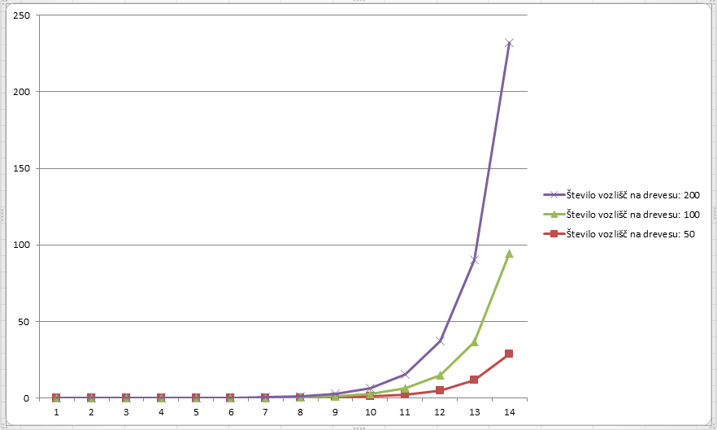

# Poročilo

*Samo Kralj*

# Opis algoritma

Ideja algoritma je, da se osredotočimo na drevo in z dinamičnim programiranjem poiščemo najtežjo množico. Ker pa nimamo samo drevesa ampak imamo
produkt drevesa in cikla, si lahko ta graf predstavljamo kot drevo, ki ima potem na vsakem vozlišču še cikel. Generiramo si bitmaske, ki nam povedo
katera vozlišča v ciklu imamo v naši množici. Iz tega pa sedaj dinamično programiranje na drevesu sledi. In sicer:

Recimo da imamo v korenu drevesa določeno masko B. Če želimo dobiti najtežjo množico s tem, da smo na korenu uporabili masko B, 
moramo poiskati najtežjo množico na vseh sinovih našega korena, pod pogojem da se maska C od sinova ne prekriva z masko B od korena oziroma, 
da je (B AND C = 0).

Tukaj pa vidimo, da se nam velikokrat ponovi problem, ki ga računamo, saj je vsako vozlišče z določeno bitmasko na korenu sam svoj problem
iskanja najtežje množice. Z memoizacijo pridemo do učinkovitega algoritma.

# Analiza časovne zahtevnosti

# Meritve časovne zahtevnosti

Za prvo merjenje sem generiral naključna drevesa T s k vozlišči in algoritem uporabil na kartezičnem produktu T x C4, T x C7 in T x C10.

Iz grafa se jasno vidi linearna časovna zahtevnost v številu vozlišč.

| Število vozlišč v drevesu | Dolžina cikla: 4 | Dolžina cikla: 7 | Dolžina cikla: 10 |
|:-----:|:---------:|:---------:|:----------:|
| 20  | 0.00302 | 0.04600 | 0.76962  |
| 50  | 0.00801 | 0.12556 | 2.09281  |
| 80  | 0.01456 | 0.20502 | 3.40917  |
| 110 | 0.01949 | 0.28205 | 4.83899  |
| 140 | 0.02400 | 0.37155 | 6.13874  |
| 170 | 0.02956 | 0.44608 | 7.38600  |
| 200 | 0.03353 | 0.51654 | 8.81765  |
| 230 | 0.03906 | 0.60459 | 10.10419 |
| 260 | 0.04445 | 0.68313 | 11.39722 |
| 290 | 0.05051 | 0.78665 | 12.80874 |
| 320 | 0.05556 | 0.84562 | 14.04720 |
| 350 | 0.05952 | 0.91160 | 15.37646 |
| 380 | 0.06452 | 1.02261 | 16.73320 |
| 410 | 0.07003 | 1.06962 | 17.95572 |
| 440 | 0.09457 | 1.14865 | 19.27492 |
| 470 | 0.09802 | 1.24866 | 20.65266 |
| 500 | 0.08546 | 1.32139 | 22.06154 |
| 530 | 0.09096 | 1.41725 | 23.39472 |
| 560 | 0.11052 | 1.50612 | 24.73277 |
| 590 | 0.10155 | 1.57963 | 25.89728 |

Za merjenje zahtevnosti v dolžini cikla pa sem generiral drevesa na 50, 100 in 200 vozliščih in izračunal T x Ck.

Iz grafa lahko preberemo eksponentno rast časa v odvisnosti od dolžine cikla. Za oceno osnove eksponenta pa si poglejmo kvociente sosednjih izmerjenih
časov. 

Poglejmo si nekaj kvocientov v spodnjem delu tabele:

470 / 179 = 2.6256
224 / 86 = 2.604
1023 / 364 = 2.8104
364 / 143 = 2.5384
143 / 56 = 2.5535
179 / 69 = 2.5942
...

Lahko sklepamo, da osnova pri eksponentu leži nekje med 2.5 in 2.8.

| Dolžina cikla | Vozlišč v drevesu: 50 | Vozlišč v drevesu: 100 | Vozlišč v drevesu: 200 |
|:----:|:-----------:|:-----------:|:------------:|
| 2  | 0.00150   | 0.00400   | 0.00700    |
| 3  | 0.00298   | 0.00650   | 0.01350    |
| 4  | 0.00849   | 0.01697   | 0.03304    |
| 5  | 0.02057   | 0.03955   | 0.08206    |
| 6  | 0.04846   | 0.10001   | 0.20460    |
| 7  | 0.14155   | 0.26299   | 0.51406    |
| 8  | 0.31009   | 0.64858   | 1.31067    |
| 9  | 0.79465   | 1.64742   | 3.40593    |
| 10 | 2.03576   | 4.20110   | 8.58516    |
| 11 | 5.26311   | 11.08873  | 22.54611   |
| 12 | 13.35390  | 27.37777  | 56.63912   |
| 13 | 34.37785  | 69.84037  | 143.21437  |
| 14 | 86.10051  | 179.31695 | 363.92527  |
| 15 | 224.50726 | 470.44878 | 1022.81468 |

